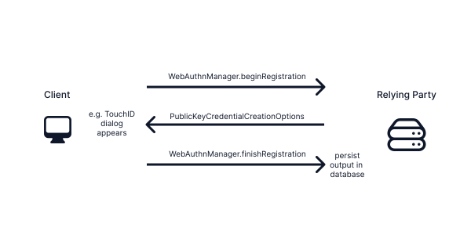
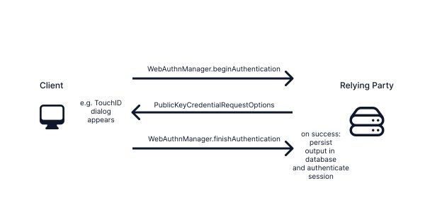

# Example Implementation

Explains how to use this library in a server <-> website scenario.

The library exposes four methods through ``WebAuthnManager``:

- ``WebAuthnManager/beginRegistration(user:timeoutInSeconds:attestation:publicKeyCredentialParameters:)``
- ``WebAuthnManager/finishRegistration(challenge:credentialCreationData:requireUserVerification:supportedPublicKeyAlgorithms:pemRootCertificatesByFormat:confirmCredentialIDNotRegisteredYet:)``
- ``WebAuthnManager/beginAuthentication(timeout:allowCredentials:userVerification:)``
- ``WebAuthnManager/finishAuthentication(credential:expectedChallenge:credentialPublicKey:credentialCurrentSignCount:requireUserVerification:)``

> Important information in advance:
    Because bytes are not directly transmittable in either direction as JSON this library provides custom `Codable` implementations for a few types.
    When using `Codable` to encode ``PublicKeyCredentialCreationOptions`` and ``PublicKeyCredentialRequestOptions`` byte array properties will be encoded to base64url strings.
    When using `Codable` to decode ``RegistrationCredential`` and ``AuthenticationCredential`` base64url encoded strings will be decoded to byte arrays.
    When data transmission happens without JSON (e.g. through GRPC) the byte arrays can be transmitted directly. In that case don't use the default `Codable` implementation provided by this library.

## Limitations

There are a few things this library currently does **not** support:

1. Currently RSA public keys are not support, we do however plan to add support for that. RSA keys are necessary for
   compatibility with Microsoft Windows platform authenticators.

2. Octet key pairs are not supported.

3. Attestation verification is currently not supported, we do however plan to add support for that. Some work has been
   done already, but there are more pieces missing. In most cases attestation verification is not recommended since it
   causes a lot of overhead.
   > [From Yubico](https://developers.yubico.com/WebAuthn/WebAuthn_Developer_Guide/Attestation.html): "If a service does not have a specific need for attestation information, namely a well defined policy for what to
     do with it and why, it is not recommended to verify authenticator attestations"

### Setup

Configure your backend with a ``WebAuthnManager`` instance:

```swift
let webAuthnManager = WebAuthnManager(
    configuration: .init(
        relyingPartyID: "example.com",
        relyingPartyName: "My Fancy Web App",
        relyingPartyOrigin: "https://example.com"
    )
)
```

### Registration

Scenario: A user wants to signup on a website using WebAuthn.



#### Explanation

1. When tapping the "Register" button the client sends a request to
   the backend. The relying party responds to this request with a call to ``WebAuthnManager/beginRegistration(user:timeoutInSeconds:attestation:publicKeyCredentialParameters:)`` which then returns a
   new ``PublicKeyCredentialRequestOptions``. This must be send back to the client so it can pass it to
   `navigator.credentials.create()`.

2. Whatever `navigator.credentials.create()` returns will be send back to the relying party, parsing it into
   ``RegistrationCredential``.
    ```swift
    let registrationCredential = try JSONDecoder().decode(RegistrationCredential.self)
    ```

3. Next the backend calls ``WebAuthnManager/finishRegistration(challenge:credentialCreationData:requireUserVerification:supportedPublicKeyAlgorithms:pemRootCertificatesByFormat:confirmCredentialIDNotRegisteredYet:)`` with the previously
   generated challenge and the received ``RegistrationCredential``. If no error are thrown a new ``Credential``
   object will be returned. This object contains information about the new credential, including an id and the generated public-key. Persist this data in e.g. a database and link the entry to the user.

##### Example implementation (using Vapor)

```swift
authSessionRoutes.get("makeCredential") { req -> PublicKeyCredentialCreationOptions in
    let user = try req.auth.require(User.self)
    let options = try req.webAuthn.beginRegistration(user: user)
    req.session.data["challenge"] = options.challenge
    return options
}

authSessionRoutes.post("makeCredential") { req -> HTTPStatus in
    let user = try req.auth.require(User.self)
    guard let challenge = req.session.data["challenge"] else { throw Abort(.unauthorized) }
    let registrationCredential = try req.content.decode(RegistrationCredential.self)

    let credential = try await req.webAuthn.finishRegistration(
        challenge: challenge,
        credentialCreationData: registrationCredential,
        // this is likely to be removed soon
        confirmCredentialIDNotRegisteredYet: { credentialID in
            try await queryCredentialWithUser(id: credentialID) == nil
        }
    )

    try await WebAuthnCredential(from: credential, userID: user.requireID())
        .save(on: req.db)

    return .ok
}
```

### Authentication

Scenario: A user wants to log in on a website using WebAuthn.



#### Explanation

1. When tapping the "Login" button the client sends a request to
   the relying party. The relying party responds to this request with a call to ``WebAuthnManager/beginAuthentication(timeout:allowCredentials:userVerification:)`` which then in turn
   returns a new ``PublicKeyCredentialRequestOptions``. This must be sent back to the client so it can pass it to
   `navigator.credentials.get()`.
2. Whatever `navigator.credentials.get()` returns will be sent back to the relying party, parsing it into
   ``AuthenticationCredential``.
   ```swift
   let authenticationCredential = try JSONDecoder().decode(AuthenticationCredential.self)
   ```
3. Next the backend calls
   ``WebAuthnManager/finishAuthentication(credential:expectedChallenge:credentialPublicKey:credentialCurrentSignCount:requireUserVerification:)``.
    - The `credential` parameter expects the decoded ``AuthenticationCredential``
    - The `expectedChallenge` parameter expects the challenge previously generated
      from `beginAuthentication()` (obtained e.g. through a session).
    - Query the persisted credential from [Registration](#registration) using the credential id from the decoded
      `AuthenticationCredential`. Pass this credential in the `credentialPublicKey` parameter and it's sign count to
      `credentialCurrentSignCount`.

4. If `finishAuthentication` succeeds you can safely login the user linked to the credential! `finishAuthentication`
   will return a `VerifiedAuthentication` with the updated sign count and a few other pieces of information to be
   persisted. Use this to update the credential in the database.

#### Example implementation (using Vapor)

```swift
// this endpoint will be called on clicking "Login"
authSessionRoutes.get("authenticate") { req -> PublicKeyCredentialRequestOptions in
    let options = try req.webAuthn.beginAuthentication()
    req.session.data["challenge"] = String.base64URL(fromBase64: options.challenge)
    return options
}

// this endpoint will be called after the user used e.g. TouchID.
authSessionRoutes.post("authenticate") { req -> HTTPStatus in
    guard let challenge = req.session.data["challenge"] else { throw Abort(.unauthorized) }
    let data = try req.content.decode(AuthenticationCredential.self)
    guard let credential = try await queryCredentialWithUser(id: data.id) else {
        throw Abort(.unauthorized)
    }

    let verifiedAuthentication = try req.webAuthn.finishAuthentication(
        credential: data,
        expectedChallenge: challenge,
        credentialPublicKey: credential.publicKey,
        credentialCurrentSignCount: credential.currentSignCount
    )

    credential.currentSignCount = verifiedAuthentication.newSignCount
    try await credential.save(on: req.db)

    req.auth.login(credential.user)

    return .ok
}
```
