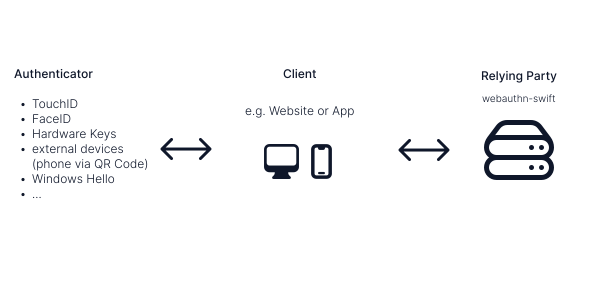

# ``WebAuthn``

A library for working with WebAuthn and Passkeys.

## Overview

WebAuthn uses public key cryptography to allow applications to authenticate using passwordless methods
such as biometrics, hardware security keys, or other devices. They're sometimes also referred to as Passkeys. The library also allows applications to implement two factor authentication using the [Universal 2nd Factor](https://en.wikipedia.org/wiki/Universal_2nd_Factor) to provide a secure second factor for authentication flows.

This library aims to simplify the implementation of the Relying Party in an application. It is responsible
for processing authenticator responses and deciding whether an authentication, or registration, attempt is valid
or not. Usually the Relying Party persists the resulting public key of a successful registration attempt alongside with
the corresponding user in a database.

## Topics

### Articles

- <doc:Example-Implementation>

### Essentials

- ``WebAuthnManager``
- ``WebAuthnConfig``
- ``PublicKeyCredentialUserEntity``

### Responses

- ``PublicKeyCredentialCreationOptions``
- ``PublicKeyCredentialRequestOptions``
- ``Credential``
- ``VerifiedAuthentication``

### Serialization

- ``RegistrationCredential``
- ``AuthenticationCredential``

### Errors

- ``WebAuthnError``
